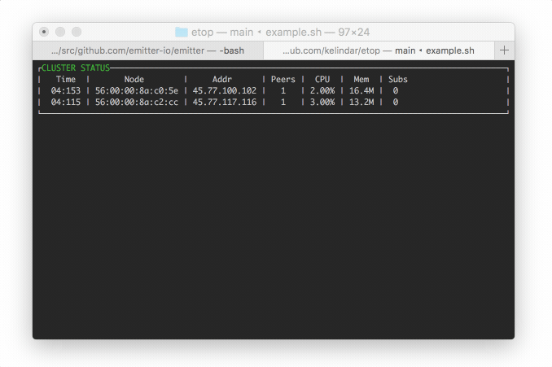

# Emitter Top Utility
Command-line utility for emitter.io cluster status. This small utility subscribes to built-in `stats/` channel in emitter cluster and prints out realtime information about the cluster including things such as the number of peers for each node, their CPU and Memory consumption and number of subscriptions.



## Usage

```
etop --key "readonly key for stats/ channel" --broker "protcol://IP:PORT"
```